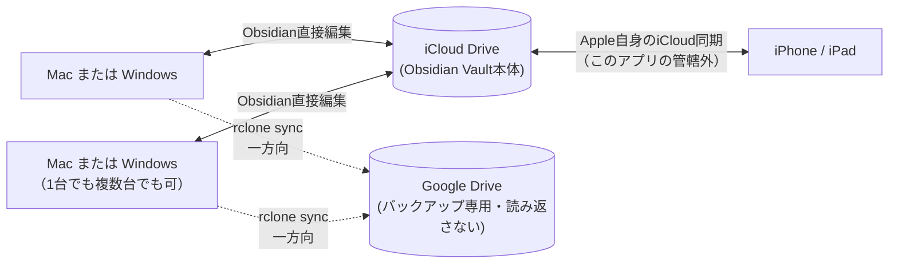
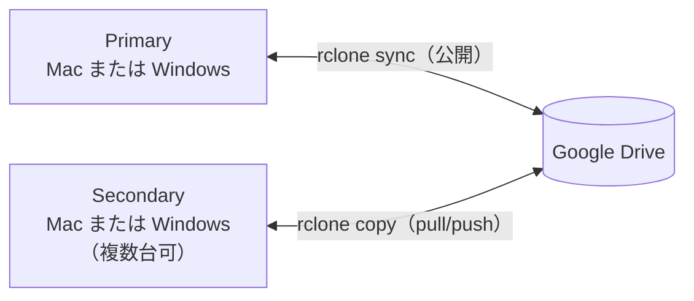
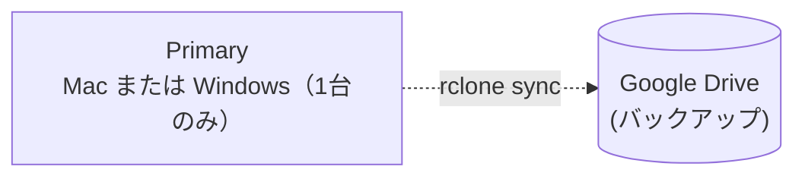
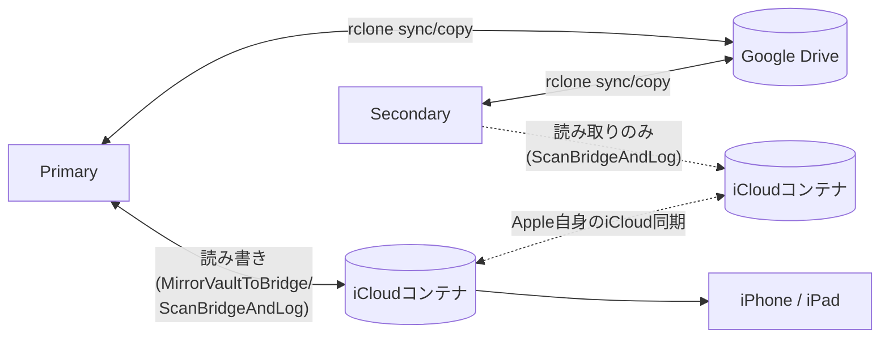

# UniteVault

Obsidian Vault（Markdownファイル群）を Mac / Windows（複数台可）/ iPhone・iPad 間で安全に利用するための同期・バックアップツールです。利用形態に応じて**3つの同期モード**（iCloud中心・Google Drive中心｜複数PC・Google Drive中心｜単一PC）からセットアップ時に1つを選びます。判断基準はシンプルで、**iPhone/iPadでObsidianを使うかどうか**です。詳しくは下記「[対応する端末構成パターン](#対応する端末構成パターン)」を参照してください。

> **Vaultフォルダの置き場所は、選ぶ同期モードによって異なります。** iPhone/iPadと連携しない**B・Cモード（Google Drive中心）**では、PC上のローカル専用フォルダに置きます（推奨: `~/Obsidian/Vault`）。iCloud Drive上に直接置く必要はありません（むしろ非推奨です。下記「なぜB・CモードではVaultをiCloudの外に置くのか」参照）。既にVaultをiCloud Drive上で使っていてB・Cモードを選ぶ場合は、初回起動時に案内ダイアログが表示されるか、Settings画面の **[ Migrate Vault to Local Folder... ]** ボタンから、ローカルフォルダへの移行（Obsidianの設定更新込み）を自動で行えます（手順5参照）。逆に**Aモード（iCloud中心）**では、VaultはObsidian専用のiCloudコンテナ内に置いたままにします（iPhone/iPadとの一貫性をAppleのiCloudに任せるため、あえてこの場所を使います）。

## 特徴

- **3つの同期モードから選択**: iPhone/iPadと連携したい場合はiCloud中心モード（Aモード）、PC間のみの同期でよければGoogle Drive中心モード（複数PC＝Bモード／単一PC＝Cモード）を選べます。セットアップ時に1つ選ぶと、以降は変更するのに設定リセットが必要です
- **B・Cモード：独自ログと3-way merge**: 複数端末が同じファイルを編集した場合の競合を、`git merge-file`を使って自動検出・マージ。PC間の同期・共有ハブはGoogle Driveが担います
- **Aモード：iCloudにすべて任せる**: Mac/Windows/iPhone/iPad間の一貫性はAppleのiCloudが担い、このアプリは各PCが独立してGoogle Driveへ一方向バックアップするだけです（Primary/Secondaryの区別・3-way merge・Vault Migrationはいずれも不要）
- **単一ウィンドウの設定画面**: メニューバー（Mac）／タスクトレイ（Windows）に常駐し、Settings画面から設定・状態確認・Google Drive接続をすべて行えます
- **OS標準のファイル監視 + 定期フルスキャン**: 常駐プロセスとして、変更検出を軽量化しつつ、監視の取りこぼしも定期フルスキャンで補います
- **Git / rclone 自動インストール**: 未インストールでもSettings画面のボタンから自動取得できます（いつ・どちらが必要かは後述）
- **単一バイナリ / .app バンドル動作**: Go言語で実装されており追加ランタイム不要

## 動作環境

- **macOS**（Apple Silicon）または **Windows 10/11**
- Obsidian Vault（新規でも、既存のものでも可）
- Google アカウント（すべてのモードで、バックアップ・PC間同期に使用）
- iPhone/iPadでもObsidianを使いたい場合は、**iCloud中心モード（Aモード）を選びます**（iCloud、WindowsではiCloud for Windowsが必要）。PC間のみで良ければiCloudは不要です
- Git・rcloneは事前インストール不要です（後述の手順内でアプリが自動的にインストールを案内します）

iPhone/iPad側は追加インストール不要です。Aモードを選んだ場合、通常のiCloud同期のみで完結します。

### なぜB・CモードではVaultをiCloudの外に置くのか

ObsidianがVaultファイルへ直接書き込むのと、iCloudの内部デーモンによる同期・独自コンフリクト処理が、同じファイルに対して同時に働き得ることが分かっています。データが失われることはありませんが（iCloud側はオフライン分岐時に両方のバージョンを「ファイル名 2.md」のような別名で保持します）、このアプリの3-way mergeとは別に、意図しない重複ファイルが残る可能性があります。B・Cモードはこのリスクを避けるため、Vault本体を常にiCloudの外（ローカル専用フォルダ）に置きます。

Aモードは、iPhone/iPadとの連携を優先し、このリスクを承知の上で選ぶモードです（利用者の明示的な選択として、1.6.10節でこの設計判断を説明しています）。詳しい経緯は [unitevault-spec.md](unitevault-spec.md) の1.6.1節・1.6.10節・3.6.1.6節を参照してください。

## 対応する端末構成パターン

上記3つの同期モードが、それぞれどんな構成になるかを図で示します（Settings画面でのモード選択手順は後述の「[はじめての方向け・セットアップ手順](#はじめての方向け・セットアップ手順)」を参照）。

### Aモード：iCloud中心（iPhone/iPad と同期する場合は必須）



Mac/Windows間・iPhone/iPad間の内容の一貫性はすべてAppleのiCloudに任せ、このアプリはPrimary/Secondaryの区別も3-way mergeも行いません。各PCが独立して、iCloud管理下のVaultの現在の内容をGoogle Driveへ一方向バックアップするだけです（詳細: spec 1.6.10節）。

### Bモード：Google Drive中心・複数PC（iPhone/iPad連携なし）



複数PC間の内容統合を、Primary/Secondary固定ハブ方式＋3-way mergeで行う、これまでの実装そのものです（詳細: spec 1.6.4節・3.3節）。

### Cモード：Google Drive中心・単一PC



Bモードの縮退形です。Secondaryが存在しないため、実質的に一方向バックアップと同じ動きになります。

### （既存ユーザー向け参考）Aモード実装前の代替構成

Aモードが実装される前は、iPhone/iPad連携を「Bモードの構成＋iCloud Bridge（iPhone連携専用のステージング領域）」で代用していました。新規にセットアップする場合は上記のAモードを選んでください。既にこの構成で運用中の場合も、そのまま使い続けられます（強制的な移行はありません）。



上図はSecondary機もiCloud Bridgeを持つ、最も複雑な構成です。SecondaryにBridgeが無い場合（Secondary自体が無い、またはSecondaryにiCloudを設定していない場合）はよりシンプルな構成になります。各パターンと対応する統合テストの一覧は [unitevault-spec.md](unitevault-spec.md) の2.1節を参照してください。

---

## はじめての方向け・セットアップ手順

### 1. ダウンロード

[Releases](https://github.com/kh813/unitevault/releases) ページから最新版をダウンロードします。

- **Mac**: `UniteVault-mac-arm64.app.zip` をダウンロードして解凍し、`UniteVault.app` を `Applications` フォルダへ移動します。
- **Windows**: `UniteVault-windows-amd64.zip` をダウンロードして、任意のフォルダに解凍します（`UniteVault.exe` が展開されます）。

### 2. 初回起動時の警告への対処

初回起動時のみ、OSのセキュリティ機能により警告が表示されます。これはアプリが未購入の開発者証明書（アドホック署名）でビルドされているためで、故障や異常ではありません。

**Mac（「"UniteVault"は壊れているため開けません」または開発元未確認の警告）**:
- `UniteVault.app` を **右クリック（Controlキー+クリック）** → 「開く」を選択し、表示される確認ダイアログでも「開く」を選択してください。
- それでも「壊れている」表示が出る場合は、ターミナルで以下を一度だけ実行してから再度開いてください。
  ```bash
  xattr -d com.apple.quarantine /Applications/UniteVault.app
  ```

**Windows（「WindowsによってPCが保護されました」という SmartScreen 警告）**:
- 警告画面の「詳細情報」をクリックし、「実行」を選択してください。

### 3. 起動 → Settingsウィンドウ

`UniteVault.app`（Mac）または `UniteVault.exe`（Windows）をダブルクリックして起動します。

- Mac: メニューバーに同期矢印のアイコンが表示されます
- Windows: タスクトレイに同期矢印のアイコンが表示されます

初回起動時は未設定のため、**Settingsウィンドウが自動的に開きます**（メニューバー／タスクトレイアイコンをクリックし、「Settings...」からいつでも再度開けます）。

### 4. 同期モードを選ぶ

「Sync Mode」セクションに、2つの選択肢がチェックボックスで表示されます（初回セットアップ時のみ表示され、**一度保存すると変更するには後述の「Reset Configuration」が必要**です）。

- **Google Drive-centric**（Google Drive中心）: 「Mac/Windowsのみ（iPhone/iPadでObsidianを使わない場合）」— Bモード（複数PC）・Cモード（単一PC）に相当します
- **iCloud-centric**（iCloud中心）: 「iPhone/iPadでObsidianを使い、Windows/Macと同期する場合（この場合は必須）」— Aモードに相当します

どちらを選ぶべきかは、上記「[対応する端末構成パターン](#対応する端末構成パターン)」の図と判断基準（iPhone/iPadでObsidianを使うかどうか）を参照してください。デフォルトは Google Drive-centric（Bモード）です。

### 5. Obsidian Vaultを指定

「Obsidian Vault」セクションの **[ Select Folder... ]** ボタンから、Vaultフォルダを選択します（OS標準のフォルダ選択ダイアログが開きます）。

**Google Drive-centric（B・Cモード）を選んだ場合：** 新規にVaultを作る場合・既存のVaultをそのまま使う場合（iCloud Drive上のVault、Google Drive Desktopの同期フォルダ内のVaultなども含む）のどちらでも、このボタン一つで完結します。

選んだフォルダがUniteVaultの管理フォルダ（`~/Obsidian/`、Windowsは `%USERPROFILE%\Obsidian\`）の外にある場合、**[ Save Settings ]** を押した時点で確認ダイアログが表示され、承諾すると以下を自動で行います。

1. Vaultフォルダをローカル専用フォルダ（`~/Obsidian/<選択したフォルダ名>`）へ移動（選んだフォルダがすでにiCloud Bridgeの配置先だった場合は、iCloud側を削除せずコピーのみ行います）
2. Obsidian自身のVault一覧（`obsidian.json`）をベストエフォートで更新（次回Obsidianを開くと新しい場所が自動的に開きます。失敗した場合はObsidianから手動で開き直すよう案内が出ます。そのVaultをMac/Windows版Obsidianで一度も開いたことが無い場合は、そもそも更新対象が無いため案内自体出ません）
3. iCloud Bridgeの配置先（Obsidian自身の専用iCloudコンテナ。Mac・Windowsとも）が検出できれば、内容をそこへシードコピーし、以降iPhone/iPadとの橋渡し（iCloud Bridge、Aモード実装前の代替構成）として継続的に同期される状態にする（選んだフォルダがすでにその配置先だった場合は、新たにコピーし直さずそのまま使います）

既に設定済みの端末を起動した際、Vaultパスが今も管理フォルダの外にあると検出された場合も、同じ移行を提案するダイアログが自動的に表示されます（「Don't Show This Again」でいつでも非表示にできます）。この移行提案・「Migrate Vault to Local Folder...」ボタンは、いずれもiCloud-centricを選んだ端末では表示されません（Vaultを意図的にiCloud内に置き続けるモードのため）。

> **複数PC＋iPhone/iPad連携をする場合の推奨：** 上記の代替構成（iCloud Bridge）を今も使っている場合、その設定はPCのうち1台（Primary機になる予定の端末）だけで行うのがおすすめです。複数のPCで同時にiCloud由来のVaultからMigrateを実行してしまうと、動作自体は問題ありませんが、同じ内容がPC間を無駄に往復してしまいます。新規にiPhone/iPad連携をする場合は、この代替構成ではなく上記のiCloud-centricモードを選んでください。

> 運用開始後（Google Driveリモート設定済みの状態）にVaultフォルダを別の場所（別ドライブ等）へ移動したい場合は、「Obsidian Vault」セクションの **[ Migrate Vault to Local Folder... ]** ボタンから行えます（Google Drive-centricのみ）。この状態ではVaultとリモートの紐付けを誤って切らないよう Select Folder 自体が無効化されているため、Vaultの場所を変える唯一の手段です。

**iCloud-centric（Aモード）を選んだ場合：** Vaultフォルダには、Obsidian自身の「iCloud」ストレージオプションが作成した、iCloud Drive内のフォルダを選びます（Mac: `~/Library/Mobile Documents/iCloud~md~obsidian/Documents/<Vault名>`、Windows: `%USERPROFILE%\iCloudDrive\iCloud~md~obsidian\<Vault名>`）。まだObsidianでVaultを作っていない場合は、先にObsidian側で「iCloud」を保存場所に選んでVaultを作成してから、ここで同じフォルダを選んでください。この場合、上記のVault Migrationは一切発生しません（Vaultは常にこの場所のままです）。

### 6. Google Driveへの接続

「rclone」セクションの **[ Configure Google Drive Remote... ]** ボタンを押します（すべてのモードで必要です。iCloud-centricでもGoogle Driveへのバックアップは行われます）。

1. 「New Setup (Recommended)」を選択します
2. ブラウザが自動的に開くので、Googleアカウントでログインし、アクセスを許可します
3. 「Google Drive Connected」と表示されれば接続完了です

（すでにお使いの rclone 設定を使いたい場合は「Existing / CLI Config」を選ぶと、ターミナル／PowerShellでの対話設定に切り替わります。）

Remote Name・Sync Interval はデフォルト値のままで問題ありません。**Google Drive Target Folder Pathは選択したVaultフォルダ名が自動的に入力される**ので、通常は変更不要です（後述のVault変更時の注意も参照）。

### 7. 保存

**[ Save Settings ]** を押します。自動的に以下が行われます。

- 設定の保存（選んだ同期モードはこの時点で確定し、以降変更できません）
- **Google Drive-centricの場合のみ：Primary / Secondary の自動判定**: Google Drive上に他端末の初期化情報（`PRIMARY_MARKER.json`）が無ければこの端末が Primary（マージ処理・Google Drive/iCloud Bridge同期を担当）、既にあれば Secondary（編集＋Google Driveへの変更のpush/pullのみ）になります。手動で選ぶ必要はありません。
- **iCloud-centricの場合：** Primary/Secondaryの判定自体が行われません。各端末が対等に、独立してGoogle Driveへバックアップします。

保存が完了すると要約ダイアログが表示され、Settingsウィンドウは閉じます。以降はバックグラウンドで自動的に同期サイクル（デフォルト60秒間隔の共通ティック）が実行されます。Google Drive-centricのPrimaryの場合、Google Drive同期とiCloud Bridge同期は同じティックで両方実行されるのではなく、両方設定されていればティックごとに交互に1つずつ実行されます（実効間隔はおよそこの値の2倍）。片方だけ設定されていれば毎ティック実行されます。iCloud-centricの場合は毎ティック、Google Driveへのバックアップのみが実行されます。

### 8. 日常的な使い方

メニューバー／タスクトレイのメニュー項目：

- **Status: ...**: 現在の状態（`Not Initialized` / `Active (primary)` / `Syncing...` / `Conflict` / `Error (...)`）
- **Sync Now**: 次の定期実行を待たずに即座に同期を1回実行
- **Settings...**: 設定の確認・変更
- **Check for Update...**: 新しいバージョンがGitHub Releasesに公開されていないか確認し、あればダウンロード・自動適用・再起動まで行う（下記参照）
- **Quit UniteVault**: 終了

**Google Drive-centricの場合：** Primary端末（最初にセットアップした端末がなりますが、Settingsから他の端末へ手動で引き継ぐこともできます）は、他端末の変更をマージしてGoogle Drive・iCloud Bridgeへ反映する役割を担うため、**定期的に起動しておく**ことを推奨します（起動していない間の他端末の変更は、Primaryが次に起動するまで反映されません）。**iCloud-centricの場合：** 全端末が対等なので、この注意は当てはまりません。どの端末も、起動している間は自分の現在の内容をGoogle Driveへバックアップし続けます。

### 9. 2台目以降のPCを追加する

追加するPCにもUniteVaultをインストールし、手順3〜7を同様に行ってください。

**Google Drive-centric（B・Cモード）の場合：**

- **手順5のVaultフォルダは、新規に空のローカルフォルダを選んでください**（1台目のVault内容をあらかじめ手動でコピーしておく必要はありません）。
- **手順6では、1台目と同じGoogleアカウント・同じリモート名を使ってください。**
- 保存すると、Google Drive上に既に `PRIMARY_MARKER.json` が存在するため、自動的に **Secondary** として初期化されます。
- **Vaultの中身は、最初の同期サイクル（デフォルト最大60秒後、または手動で「Sync Now」を実行）で、Google Driveから自動的に取り込まれます。** 保存直後は空のままなので、少し待つか「Sync Now」を実行してください。
- iPhone/iPadは追加インストール不要です（旧代替構成のiCloud Bridgeを使っている場合、Primary機のiCloud Bridgeフォルダが、通常のiCloud同期でiPhone/iPadにも配布されます）。

**iCloud-centric（Aモード）の場合：** 追加するPCも同じiCloudアカウントにサインインしていれば、そのPC上のiCloud Drive内に同じVaultフォルダが既に存在するはずです（Apple自身のiCloud同期による）。手順5ではそのフォルダを選び、手順6では1台目と同じGoogleアカウント・同じリモート名を使ってください。Primary/Secondaryの区別が無いため、「新規に空のフォルダを選ぶ」手順は不要です。

### 10. Vaultを変更する場合の注意

Google Driveへのバックアップ公開は`rclone sync`（同期先を同期元と完全一致させるミラー転送）で行われます。そのため、**同期するVaultを別のフォルダに切り替える際、Google Drive Target Folder Pathを前と同じにしたままにすると、次回の同期で以前のVaultのバックアップファイルが削除され、新しいVaultの内容で上書きされます**。

これを防ぐため、Google Drive Target Folder Pathは選択したVaultフォルダ名を自動的に提案し、Vaultを選び直すたびに追従します（手動で変更した値は上書きされません）。加えて、**rcloneリモートが設定済みの間はVaultフォルダの変更自体ができません**（Vault Folder Location欄が非アクティブ化され、先にリモートを削除するよう案内が表示されます）。Vaultを変更したい場合は、先に「rclone」セクションの **[ Remove Remote Configuration... ]** でリモートを削除し、Vaultを変更した後、改めてリモートを設定してください。

不要になった過去のバックアップフォルダは、Google Drive上で手動削除してください（アプリからは自動削除しません）。

---

## Git と rclone、それぞれいつ必要になるか

Settingsウィンドウの「Status」セクションから、それぞれ未インストールの場合はワンクリックでインストールできます（自動インストールに失敗した場合は公式ダウンロードページへの案内が表示されます）。ただし、実際に必要となる条件は異なります。

- **Git**: Google Drive-centric（B・Cモード）で、編集端末が **2台以上** あり、同じファイルが競合編集された場合の自動マージにのみ使われます。**Windows/Mac 1台だけでObsidianを使い、Google Driveへバックアップするだけ**（Cモード）や、**iCloud-centric（Aモード、内容の一貫性をAppleのiCloudに任せるため、このアプリ自身は3-way mergeを行わない）** であれば、Gitは一度も使われません。ただし将来的に端末を追加する可能性に備え、初回セットアップ時にインストールしておくことを推奨します（未インストールのままでも動作は継続できます）。
- **rclone**: すべてのモードで、Google Driveへのバックアップに必須です。加えてGoogle Drive-centricでは複数端末構成でのPrimary/Secondary判定にも使われるため、**バックアップ機能を使わない「同期のみ」構成は現状サポートしていません**。Google Drive-centricのSecondaryにとってGoogle Driveは他端末の変更を受け取る唯一の経路であるため、未設定のままだとSettings画面に **⚠ Google Drive not configured** という警告が表示されます。

詳細な設計根拠は [unitevault-spec.md](unitevault-spec.md) の3.6.3.1節を参照してください。

---

## アップデート方法

メニューバー／タスクトレイの **[ Check for Update... ]** から、新しいバージョンがGitHub Releasesに公開されていないか確認できます。

- 新しいバージョンがある場合、確認ダイアログの後に自動でダウンロード・適用・再起動まで行われます（手動での再インストールは不要です）。
- 自己アップデートは**Mac版（.appとしてインストール済みの場合）とWindows版のみ対応**です（`go run`等の開発時実行では自己更新できません）。
- ダウンロードや置き換えのいずれかの段階で失敗した場合、既存のインストール状態は変更されず、エラーメッセージとともに手動ダウンロード用のReleaseページへのリンクが表示されます。

---

## トラブルシューティング

- **Git/rcloneのインストールを促すダイアログが毎回出る**: 未初期化のままGit/rcloneが未検出の場合、起動のたびに案内ダイアログが表示されます。表示不要な場合は「Don't show this again」にチェックを入れてください。
- **「Move Your Vault to UniteVault's Local Folder?」ダイアログが出る**: Google Drive-centric（B・Cモード）を選んだ端末で、現在のVaultパスがUniteVaultの管理フォルダ（`~/Obsidian/`）の外にあると検出されました（iCloud Drive、Obsidian専用iCloudコンテナ、Google Drive Desktopの同期フォルダなど）。「Migrate Now」で自動移行するか、「Don't Show This Again」で今後表示しないようにできます（手順5参照）。iCloud-centricを選んだ端末ではこのダイアログは出ません（Vaultを意図的にiCloud内に置き続けるモードのため）。
- **Secondaryとして追加した端末でVaultが空のまま**: 最初の同期サイクル（デフォルト最大60秒）を待つか、メニューの「Sync Now」を実行してください（手順9参照。Google Drive-centricのみ該当）。
- **同期モードを選び間違えた**: モードは保存すると変更できません。**[ Reset Configuration ]**（下記参照）でローカル設定をクリアしてから、Settingsウィンドウを開き直して選び直してください（Vault本体やGoogle Drive上のバックアップファイル自体は削除されません）。
- **設定をやり直したい**: Settingsウィンドウ内の **[ Reset Configuration ]** ボタンから、ローカルの設定・端末役割情報（選んだ同期モードを含む）をクリアして初期状態に戻せます（誤操作防止のため、タスクトレイメニューには配置していません）。
- **Google Driveの接続をやり直したい（別のGoogleアカウントに変更したい等）**: rcloneセクションの **[ Remove Remote Configuration... ]** ボタン（リモートが設定済みの場合のみ表示）から、確認の上でrclone側の認証情報を削除できます。Google Drive上のバックアップファイル自体は削除されません。削除後、改めて **[ Configure Google Drive Remote... ]** から設定し直せます。
- **タスクトレイ／メニューバーが「Status: Conflict」と表示される**: 複数端末が同じファイルの同じ箇所を編集した（自動マージできない、真の競合）か、複数端末が同時にPrimaryだと判断している状態です。Settingsウィンドウの **Status** セクションに表示される **[ Resolve Conflicts... ]** または **[ Promote to Primary... ]** ボタンから解決できます。ファイル競合は、Obsidian上で該当ファイルを直接開いて手動でコンフリクトマーカー（`<<<<<<<`等）を編集・削除しても解決できます。
- **ローカルの設定・ログの保存場所**:
  - Mac: `~/.unitevault/`（`config.json`, `device_id`, `role`, `engine.log` 等）
  - Windows: `%APPDATA%\unitevault\`
- 同期の詳しい仕組み（変更検出・競合解決ルール・Primary/Secondary判定・アーキテクチャ全体など）は [unitevault-spec.md](unitevault-spec.md) を参照してください。

---

## 上級者向け：CLIでの利用

GUIを使わず、常駐デーモンとして手動で動かしたい場合は、CLIサブコマンドも利用できます（GUIと同じローカル設定ファイルを共有します）。

```bash
# 初期化（Vaultパス・Google Driveリモートを指定して初期化）
./unitevault init -vault "/path/to/YourVault" -remote Vault -remote-path VaultBackup

# 同期サイクルを1回だけ実行
./unitevault run --once

# 常駐デーモンとして定期実行（デフォルトの動作。OS標準のファイル監視も有効）
./unitevault run

# 現在の端末ID・役割・設定を確認
./unitevault status

# この端末を手動でPrimaryに昇格
./unitevault promote
```

CLIを使う場合もGitのインストールは事前に必須です（`init`/`run`は起動時にGit未検出だとエラー終了します。rcloneは未検出でも自動ダウンロードされます）。

`init`は常にGoogle Drive-centric（B・Cモード）で初期化します。iCloud-centric（Aモード）を使いたい場合は、GUIのSettingsウィンドウから同期モードを選んでください。

## ドキュメント

- [unitevault-spec.md](unitevault-spec.md) - 詳細仕様書
- [unitevault-todo.md](unitevault-todo.md) - 実装ToDoリスト

## ライセンス

[MIT License](LICENSE)です。コードのコピー・改変・再配布・フォークは自由ですが、本ソフトウェアは無保証で提供され、ファイル操作やデータの取り扱いに起因する不具合・損害について作者は一切の責任を負いません。

UI表示フォントとして [Noto Sans JP](https://fonts.google.com/noto/specimen/Noto+Sans+JP)（[SIL Open Font License 1.1](internal/gui/fonts/OFL.txt)）を同梱しています。
